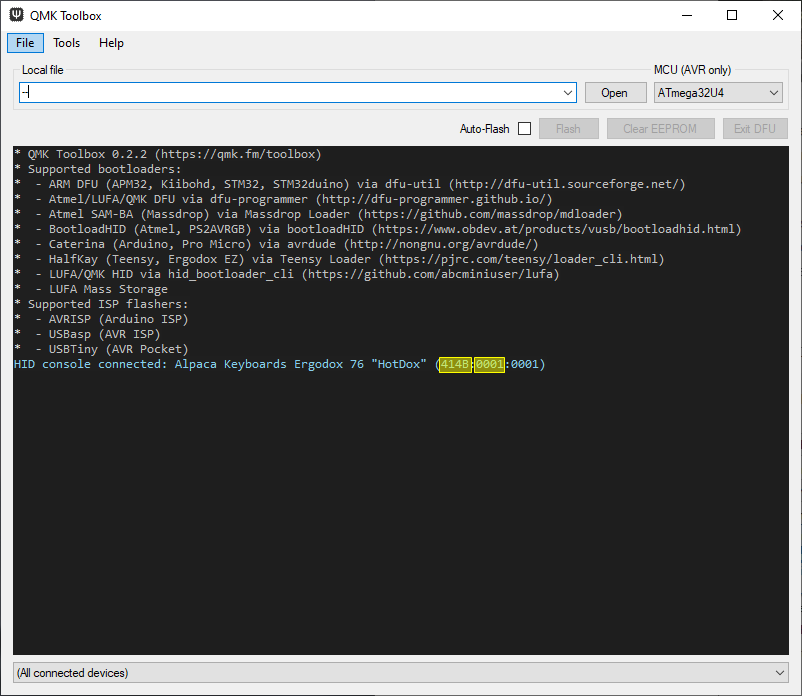

# KBLayerHelper AHK v2

> [!IMPORTANT]
> THIS IS A CURRENT PROJECT - REWORKING WITH AHK V2

On Screen Display of layer name and layout image for QMK keyboards - Autohotkey based.

## Overview

This Autohotkey script listen to QMK HID debug messages sent on layer changes and notifies the user by displaying the layer index on the tray icon, a layout image and the layer name.


Layout image and layer name are always-on-top, click-through windows, their position and duration can be configured in the .ini file.

The tray icon menu allow to activate/deactivate the layout or layer name display.

Remark : Default layer changes are not taken into account.

## Requirements

This script requires Autohotkey v1.1+ and AHKHID library.
The QMK keymap must be modified to send debug messages (see below).

## Setup

-   Download and install [Autohotkey v1.1+](http://www.ahkscript.org/).
-   Download [AHKHID](https://github.com/jleb/AHKHID) and copy `AHKHID.ahk` in _autohotkey/lib_ folder.
    Clone this repo.

-   In QMK, enable console mode (`CONSOLE_ENABLE = yes` in your `rules.mk`) and in your `keymap.c`, include _print.h_ and add the following function and update your firmware.

    ```c++
    #include "print.h"

    ...

    // Call on every layer change.
    // Send KBHLayerN (N is layer index)
    //      Add M if Swap Hands is active
    // Used by Autohotkey to display current layer info.

    layer_state_t layer_state_set_user(layer_state_t state) {
        uprintf("KBHLayer%u%s\n", get_highest_layer(state), swap_hands ? "M" : "");
        return state;
    }


    ```

-   Edit `KBLayerHelper.ini` to fill your keyboard VendorID and ProductID.
    Use the QMK toolbox to get these :
    

    You can also retrieve them using [USBDeview from Nirsoft](http://www.nirsoft.net/utils/usb_devices_view.html) or the Windows Device Manager.

-   Edit the _layers_ section with your names and images.

### KBLayerHelper.ini

```ini
[Device]
VendorId = 0x414B
ProductId = 0x0001

[General]
; Layout and layer name remain on screen if NoDisplayTimeout is on
; Duration has no effect
NoDisplayTimeout =0
; Hotkey to enable/disable NoDisplayTimeout.
LockHotKey =+^!#F12

; Display layout image, as configured in [Layers] section
[Layout]
DisplayLayout =1
; Timeout before hiding layout (ms)
Duration = 3000
; Position on screen (x, y)
; integer or 'center'
; If >= 0 : from left/top,
; if < 0 : from right/bottom
Position = center, -50
; Size (width, height)
; Image is resized to fit in defined size respecting aspect ratio
Size = 600, 200
; Font size of the layer name added on the image
FontSize = 18


; Display the layer name alone
[LayerName]
DisplayLayerName =1
Position = -50, -50
; The size of the label is fixed, set it according to your
; longest layer name and the font size
Size = 200, 30
Duration = 3000
FontSize = 20


; Define the layers :
;   - Reference as passed by QMK : what follows 'KBHLayer', should be the 0-based layer index (with M if mirrored with Swap Hands)
;   - Name to use on the layout image and the label
;   - Icon used on the tray
;   - Layout image to display
[Layers]
; Layer Name, icon file, help image
; default values :
; "Layer ref/index"Layer N", "./icons/ico/Number-N.ico", "./png/Layer-N.png"
Layer= ,Base, ,./png/Base.png
Layer= ,Azerty, ,./png/Azerty.png
Layer= ,Game, ,./png/Game.png
Layer= ,Symbols, ,./png/Symbol.png
Layer= ,Numbers, ,./png/Numpad.png
Layer= ,Nav, ,./png/Nav.png
Layer= 0M,Base-M, ./icons/ico/Number-0.ico,./png/Base.png
Layer= 1M,Azerty-M, ./icons/ico/Number-1.ico,./png/Azerty.png
Layer= 2M,Game-M, ./icons/ico/Number-2.ico,./png/Game.png
Layer= 3M,Symbols-M, ./icons/ico/Number-3.ico,./png/Symbol.png
Layer= 4M,Numbers-M, ./icons/ico/Number-4.ico,./png/Numpad.png
Layer= 5M,Nav-M, ./icons/ico/Number-5.ico,./png/Nav.png

```
